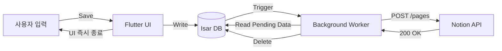

# Product Requirements Document (PRD)

| Project Name | Bolt (볼트) |
| --- | --- |
| **Package Name** | `com.krwd.bolt` |
| **Version** | 1.0.0 (MVP) |
| **Status** | **Draft** (Ready for Dev) |
| **Platform** | Android & iOS (Flutter) |
| **Owner** | Chief Architect |

---

## 1. Executive Summary (개요)

**Bolt**는 Notion 사용자를 위한 **'초고속 메모 입력 도구(Instant Write-only Client)'**이다.
공식 Notion 앱의 무거운 로딩과 복잡한 내비게이션 문제를 해결하며, **"앱 실행부터 저장까지 3초 이내"**를 목표로 한다. 오프라인 우선(Offline-First) 아키텍처를 채택하여 네트워크 상태와 무관하게 사용자의 사고 흐름을 끊지 않는다.

### 1.1 Core Value Proposition (핵심 가치)

1. **Speed (속도):** 로딩 없는 즉각적인 입력창 노출.
2. **Reliability (신뢰성):** 인터넷이 끊겨도 로컬에 100% 저장 후 자동 동기화.
3. **Simplicity (단순함):** 읽기 기능 배제, 오직 '쓰기'에만 집중.

---

## 2. Technical Architecture (기술 아키텍처)

### 2.1 Tech Stack Strategy

| Component | Technology | Rationale |
| --- | --- | --- |
| **Framework** | **Flutter** | iOS/Android 동시 대응 및 빠른 UI 렌더링. |
| **Auth Server** | **Firebase Cloud Functions** | 서버리스(Serverless). OAuth 2.0 `Client Secret` 보호용 중계 서버. |
| **Local DB** | **Isar Database** | SQLite 대비 압도적 속도, Flutter 친화적 NoSQL. |
| **Background** | **WorkManager** (Android)<br>

<br>**Background Fetch** (iOS) | 앱 종료 후에도 데이터 전송 보장 (Fire-and-Forget). |
| **Security** | **Flutter Secure Storage** | Access Token의 암호화 저장 (Keychain/Keystore). |

### 2.2 System Data Flow



---

## 3. User Stories (사용자 스토리)

| ID | Actor | Feature | Description | Acceptance Criteria (인수 조건) |
| --- | --- | --- | --- | --- |
| **US-01** | User | **OAuth 로그인** | 사용자는 자신의 노션 계정을 앱에 연결할 수 있다. | - 웹뷰를 통해 노션 로그인 페이지가 떠야 함.<br>

<br>- 로그인 성공 시 Access Token이 기기에 안전하게 저장되어야 함. |
| **US-02** | User | **타겟 DB 설정** | 사용자는 메모가 저장될 노션 페이지를 선택할 수 있다. | - 검색 API를 통해 접근 가능한 DB 목록이 리스트로 보여야 함.<br>

<br>- 선택한 DB ID가 로컬에 저장되어야 함. |
| **US-03** | User | **즉시 메모 작성** | 앱을 켜자마자 키보드가 올라오고 바로 입력할 수 있다. | - 스플래시 화면 없이 메인 UI 진입.<br>

<br>- `TextField`에 `autofocus` 적용.<br>

<br>- 저장 버튼 또는 '엔터' 키로 전송. |
| **US-04** | System | **오프라인 큐** | 인터넷이 없어도 저장이 되어야 한다. | - 비행기 모드에서 저장 시 에러 없이 "저장됨" 토스트 메시지 노출.<br>

<br>- 네트워크 연결 시 자동 전송. |
| **US-05** | User | **공유하기(Share)** | 다른 앱(브라우저 등)에서 텍스트를 Bolt로 보낼 수 있다. | - 안드로이드/iOS 공유 시트(Share Sheet)에 'Bolt' 아이콘 노출.<br>

<br>- 선택 시 팝업 창에서 바로 저장 가능. |

---

## 4. Database Schema (Isar DB)

사용자의 기기 내부에 생성될 데이터베이스 구조입니다.

```dart
@collection
class MemoItem {
  Id id = Isar.autoIncrement; // 로컬 고유 ID

  @Index()
  late String content;        // 메모 내용

  late String targetDbId;     // 노션 DB ID (저장 위치)

  late DateTime createdAt;    // 생성 시간

  @Index()
  @enumerated
  late SyncStatus status;     // 상태 (PENDING, SYNCING, FAILED)

  int retryCount = 0;         // 재시도 횟수 (Max 5)
}

enum SyncStatus { pending, syncing, failed }

```

---

## 5. UI/UX Guidelines (디자인 가이드)

* **Color Palette:**
* Primary: `Bolt Yellow` (#FFD700) - 번개의 이미지
* Background: `Notion White` (#FFFFFF) / `Notion Dark` (#191919)


* **Interaction:**
* **입력 완료 시:** 별도의 "성공 팝업"을 띄우지 않고, 은은한 햅틱(진동) 피드백과 함께 화면 하단에 작은 `Snackbar` ("Saved!")를 띄운 뒤 앱을 `minimize` 한다.
* **에러 발생 시:** 사용자에게 즉시 알리지 않고, `Badge` 등을 통해 재시도 필요함을 조용히 알린다.


---

## 6. Milestones (개발 로드맵)

### Phase 1: MVP (W1 ~ W2) - *Current Goal*

* [ ] Flutter 프로젝트 생성 (`com.krwd.bolt`)
* [ ] Firebase Functions 배포 (OAuth 중계 서버)
* [ ] Notion 로그인 및 토큰 저장 구현
* [ ] 텍스트 입력 및 Isar DB 저장 구현
* [ ] 기본 노션 API 연동 (Text Block 생성)

### Phase 2: Stability (W3 ~ W4)

* [ ] WorkManager 백그라운드 동기화 로직 구현
* [ ] 네트워크 예외 처리 및 재시도(Retry) 로직
* [ ] 공유하기(Share Intent) 기능 추가
* [ ] 다크 모드 지원

### Phase 3: Expansion (Post-Launch)

* [ ] 이미지 첨부 기능
* [ ] 홈 화면 위젯 (바로가기)
* [ ] 태그(#) 자동 인식 및 노션 태그 변환

---

## 7. Security & Compliance (보안 및 정책)

1. **Access Token 보호:**
* 절대 평문 저장 금지. `FlutterSecureStorage` 사용 필수.


2. **Data Privacy:**
* 사용자의 메모 데이터는 개발자의 서버(Firebase)를 거치지 않고, 사용자 기기에서 노션 서버로 **직접 전송(Direct Upload)** 한다.


3. **API Rate Limit:**
* 노션 API 제한(초당 3회)을 고려하여, 백그라운드 동기화 시 딜레이(`Future.delayed`)를 적용한다.


---

**Next Step:**
이 문서를 바탕으로 바로 개발을 시작하시면 됩니다.
가장 먼저 **Flutter 프로젝트 생성**(`flutter create --org com.krwd bolt`)부터 진행하시겠습니까?